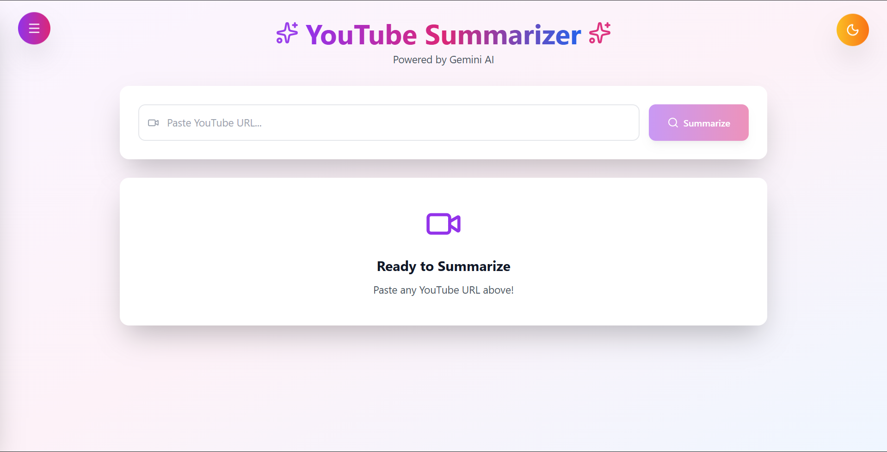
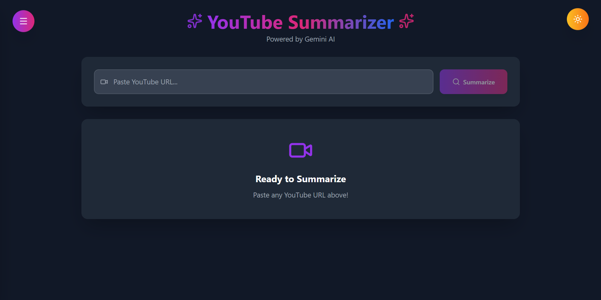
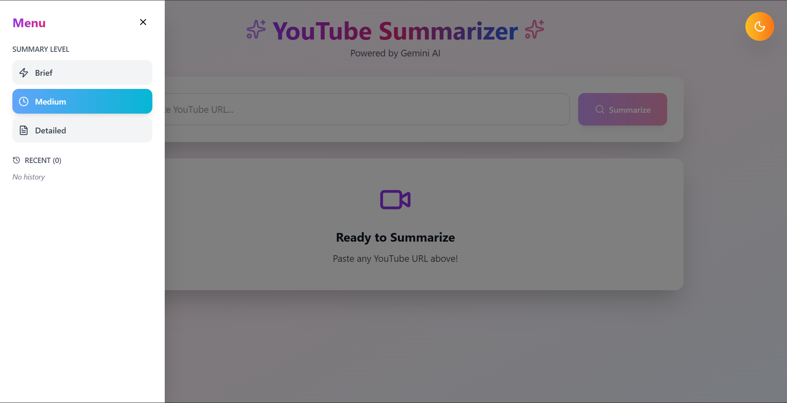
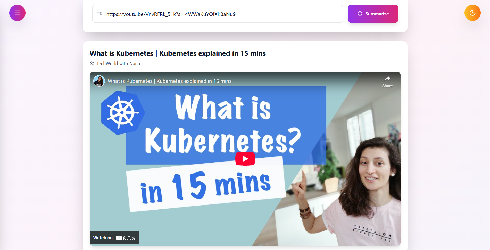
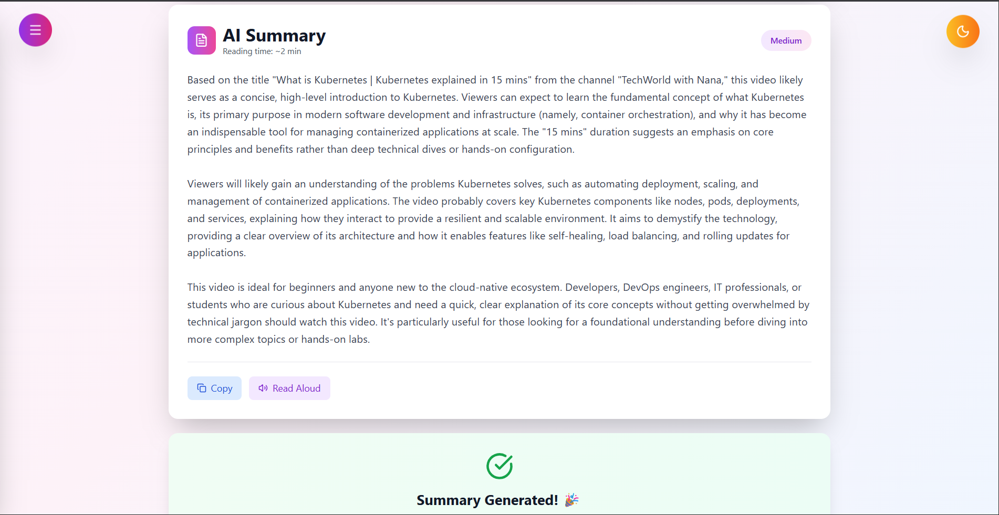

# YouTube Summarizer

A React-based web app that summarizes YouTube videos using Gemini AI and YouTube transcripts. Features include different summary levels (brief, medium, detailed), history tracking, favorites, dark mode, and text-to-speech.

## Screenshots

### 🌟 Home Screen

<div align="center">

| Light Mode | Dark Mode |
|------------|-----------|
|  |  |
| *Clean gradient interface with URL input* | *Elegant dark theme for comfortable viewing* |

</div>

### 📱 Sidebar Menu

<div align="center">



*Access summary levels, history, and favorites*

</div>

### 🎥 Video Player

<div align="center">



*Embedded YouTube player with video information*

</div>

### ✨ AI Summary & Success

<div align="center">



*AI-generated summary with success notification and action buttons*

</div>

---

## Features

- Extract video info and embed player from YouTube URL
- Fetch transcripts via YouTube Data API (falls back if unavailable)
- Generate AI summaries using Google Gemini (with fallback to dummies)
- Sidebar for history, favorites, and summary level selection
- Copy summary, read aloud, and success notifications
- Dark/light mode toggle
- Responsive UI with Tailwind CSS and Lucide icons

## Prerequisites

- Node.js (for local dev, optional with Docker)
- Docker & Docker Compose (for containerized run)
- API Keys:
  - Gemini AI: From [Google AI Studio](https://aistudio.google.com/app/apikey)
  - YouTube Data API v3: Enable in [Google Cloud Console](https://console.cloud.google.com/apis/library/youtube.googleapis.com) → Credentials → Create API Key

## Installation

1. Clone the repo:
   ```bash
   git clone https://github.com/yourusername/youtube-summarizer.git
   cd youtube-summarizer
   ```

2. Set up environment variables:
   ```bash
   cp .env.example .env
   ```
   
   Edit `.env`:
   ```env
   REACT_APP_GEMINI_API_KEY=your_gemini_key_here
   REACT_APP_YOUTUBE_API_KEY=your_youtube_api_key_here
   ```

## Running the App

### With Docker (Recommended: One-Command)

```bash
docker compose up --build
```

- Access: http://localhost:3000
- Stop: `Ctrl+C`, then `docker compose down`

### Locally (Without Docker)

1. Install dependencies:
   ```bash
   npm install
   ```

2. Start:
   ```bash
   npm start
   ```

- Access: http://localhost:3000

## Usage

1. Paste a YouTube URL (e.g., `https://www.youtube.com/watch?v=VnvRFRk_51k`)
2. Select summary level (brief/medium/detailed) from sidebar
3. Hit "Summarize"—get AI-generated content with video embed and options

## Project Structure

```
youtube-summarizer/
├── public/
│   └── index.html
├── src/
│   ├── App.js              # Main React component
│   ├── index.js            # Entry point
│   └── index.css           # Tailwind imports
├── .env                    # Environment variables (create this)
├── .env.example            # Example env file
├── package.json            # Dependencies
├── tailwind.config.js      # Tailwind configuration
├── Dockerfile              # Docker configuration
└── docker-compose.yml      # Docker Compose setup
```

## Technologies Used

- **React** - Frontend framework
- **Tailwind CSS** - Styling
- **Lucide React** - Icon library
- **Google Gemini AI** - Summary generation
- **YouTube Data API** - Video information
- **Docker** - Containerization

## Troubleshooting

### API Key Not Working

1. Verify `.env` file exists in project root
2. Check key format: `REACT_APP_GEMINI_API_KEY=AIza...`
3. Restart dev server: `npm start`
4. Check browser console for debug info

### 404 Error from Gemini

- Ensure you're using `gemini-1.5-flash-latest` model
- Regenerate API key from Google AI Studio

### No Summary Generated

- Check browser console (F12) for errors
- Verify API key is loaded: Look for "API Key exists: true"
- Ensure you have internet connection

## Contributing

1. Fork the repository
2. Create a feature branch: `git checkout -b feature-name`
3. Commit changes: `git commit -m 'Add feature'`
4. Push to branch: `git push origin feature-name`
5. Open a Pull Request

## Adding Screenshots

Your screenshots are already included! Here's the structure:

```
screenshots/
├── home-light.png          # Homepage in light mode
├── home-dark.png           # Homepage in dark mode
├── sidebar.png             # Sidebar menu with options
├── video-fetched.png       # Video player embedded
└── summary-success.png     # Summary with success message
```

To update screenshots:

1. **Take new screenshots** using Windows: `Windows + Shift + S` or Mac: `Cmd + Shift + 4`

2. **Save with the same names** in the `screenshots/` folder

3. **Commit changes:**
   ```bash
   git add screenshots/
   git commit -m "Update screenshots"
   git push
   ```

The images will automatically update in your GitHub README!

## License

MIT License - feel free to use this project for learning or personal projects.

## Acknowledgments

- Google Gemini AI for summary generation
- YouTube for video data
- Lucide for beautiful icons
- Tailwind CSS for styling

## Contact

For questions or support, please open an issue on GitHub.

---

**Built with ❤️ using React and AI**